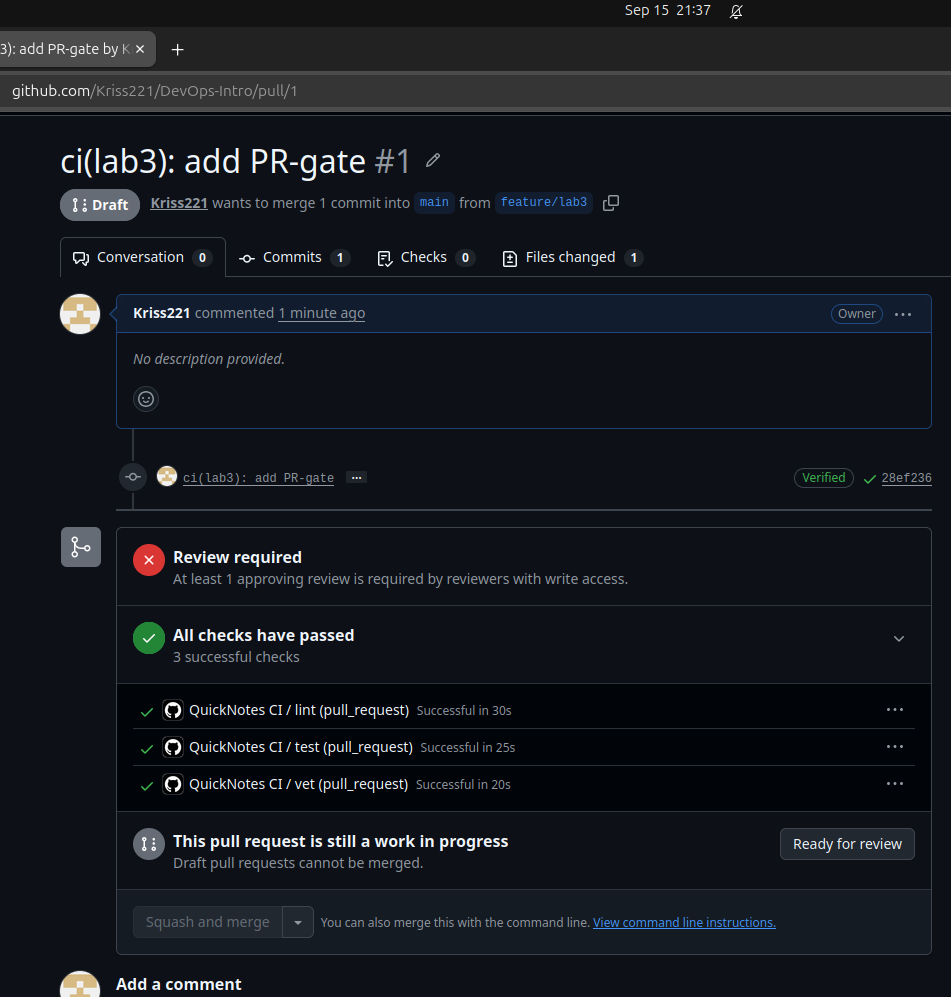
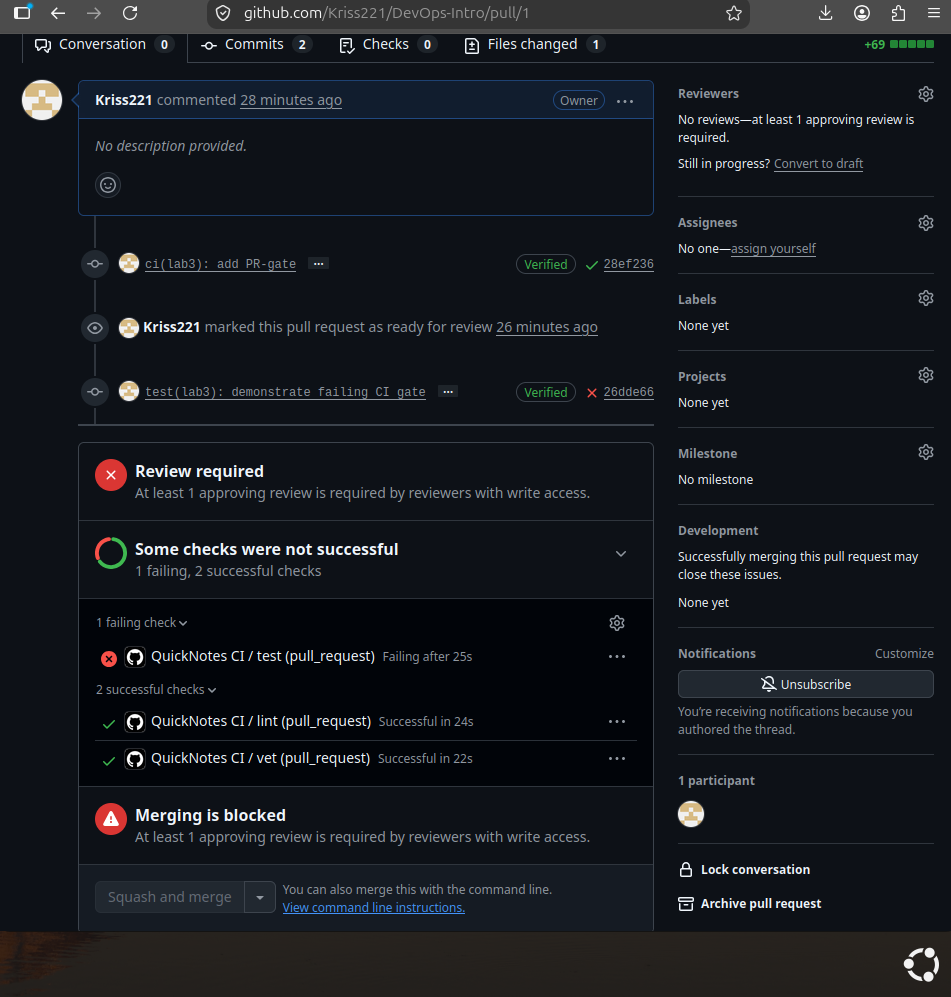
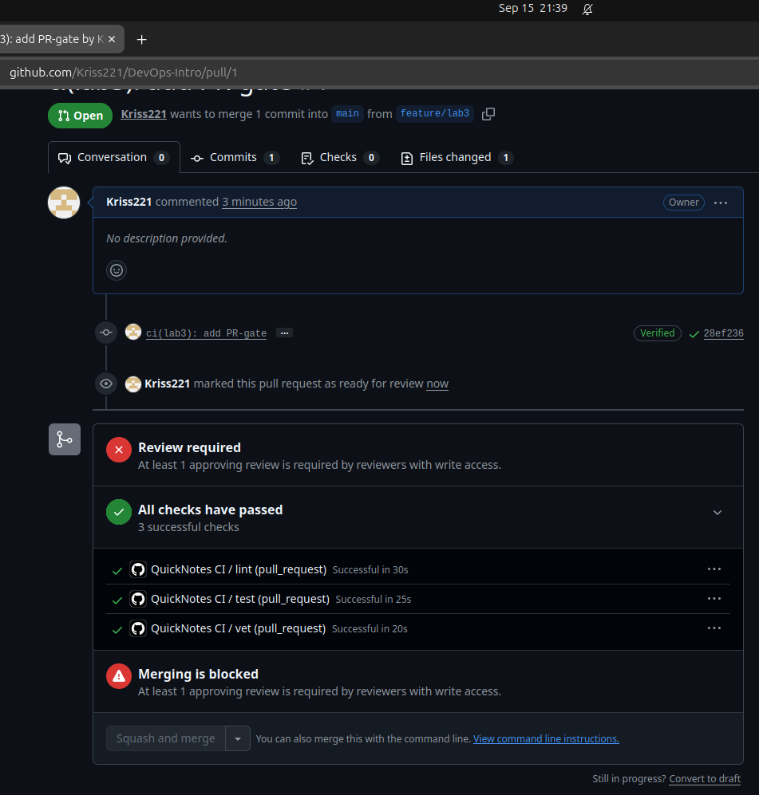
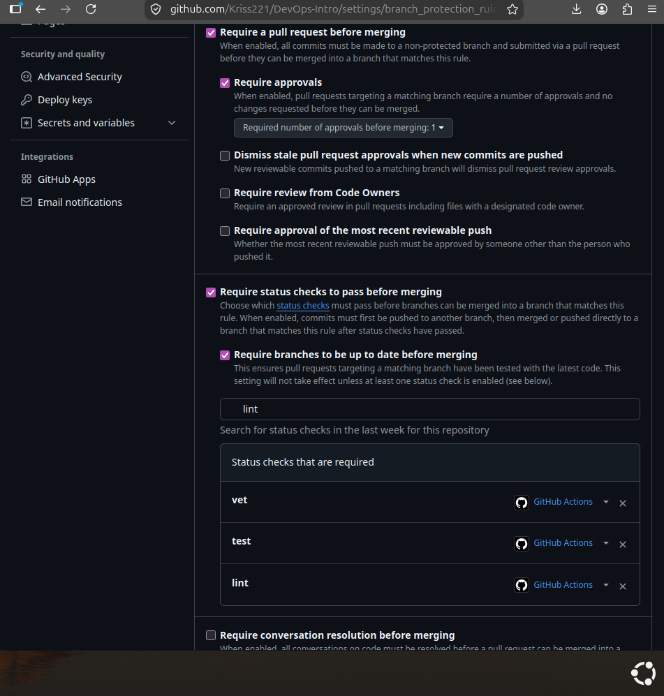
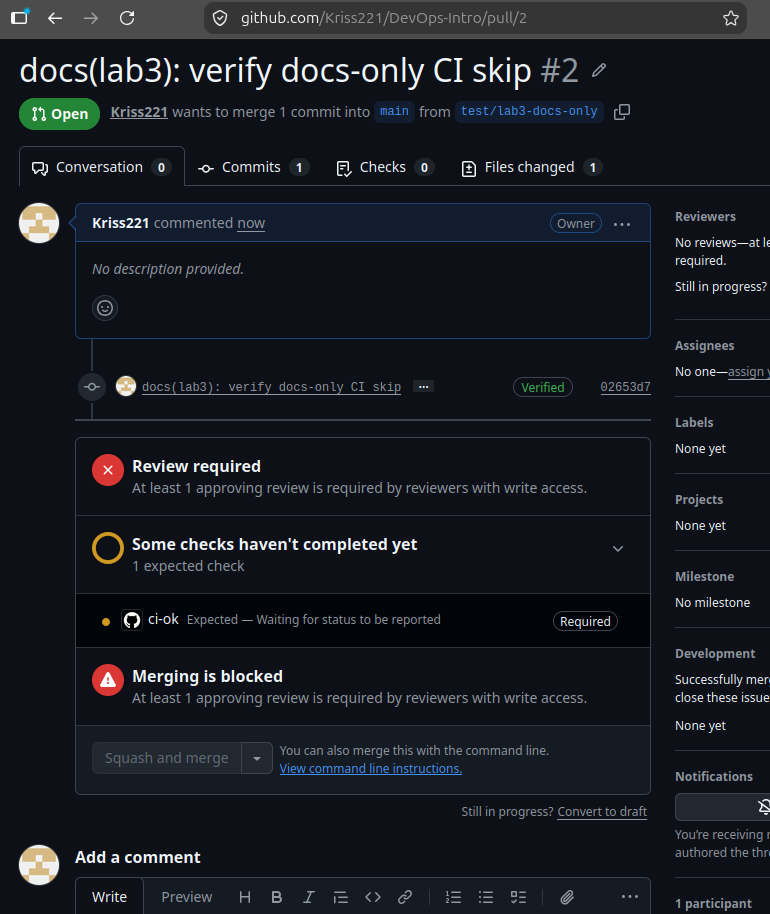

# Lab 3 — CI/CD: A PR-Gated Pipeline for QuickNotes

## Task 1 — PR Gate

### Chosen Path

I chose **GitHub Actions** because the project is hosted on GitHub and I already use GitHub for the course repository, pull requests, and branch protection. The CI workflow is stored in `.github/workflows/ci.yml`.

The workflow runs on pushes to `main` and on pull requests targeting `main`. It contains three independent jobs:

- `vet` → `go vet ./...`
- `test` → `go test -race -count=1 ./...`
- `lint` → `golangci-lint run`

All jobs use `ubuntu-24.04`, and the GitHub Actions used in the workflow are pinned to full commit SHAs. The workflow also declares `permissions: contents: read` to follow the principle of least privilege.

### Green CI Run

The initial baseline pipeline completed successfully with all three checks passing:

- `lint` — passed
- `test` — passed
- `vet` — passed

Green CI run:  
<PASTE_GREEN_CI_RUN_LINK_HERE>

### Deliberate Failure and Fix

To prove that the CI gate detects failures, I intentionally changed the expected HTTP status in `app/handlers_test.go` from `http.StatusOK` to `http.StatusCreated`.

The local test command:

`go test -race -count=1 ./...`

failed with:

`TestHealth_ReportsCount: status: 200`

I committed the intentional failure with:

`test(lab3): demonstrate failing CI gate`

After pushing the commit, the GitHub Actions results were:

- `test` — failed
- `lint` — passed
- `vet` — passed

This confirmed that a failing test makes the CI pipeline unsuccessful.

I then restored the correct expected value, `http.StatusOK`, and created the follow-up commit:

`test(lab3): restore passing test`

After this fix, all three CI checks passed again.

### Branch Protection

I configured branch protection for `main` with the following requirements:

- Require a pull request before merging
- Require status checks to pass before merging
- Require branches to be up to date before merging
- Required status checks: `vet`, `test`, and `lint`
- Require signed commits
- Require linear history

This ensures that changes cannot be merged into `main` unless the required CI checks complete successfully.

## Design Questions

### a) Why pin the runner version instead of using `ubuntu-latest`?

Pinning the runner to a specific version such as `ubuntu-24.04` makes the CI environment predictable and reproducible. If `ubuntu-latest` changes to a newer Ubuntu release, installed tools, libraries, or system behavior may change without any modification to the repository. This could cause a previously working pipeline to fail unexpectedly.

### b) Why split vet, test, and lint into separate jobs?

Splitting `vet`, `test`, and `lint` into separate jobs makes it immediately clear which type of check failed. The jobs can also run independently and in parallel, reducing the overall wall-clock time of the pipeline. If everything were placed in one combined job, later checks might not run after the first failure, and it would be harder to distinguish the source of the problem.

### c) What attack does SHA pinning prevent?

SHA pinning protects the workflow from supply-chain attacks in which a mutable action tag is changed or compromised. If a workflow uses a tag such as `@v4`, the code behind that tag can potentially change while the workflow file itself remains unchanged. Pinning the action to a full 40-character commit SHA ensures that CI executes the exact reviewed version of the action.

The relevant example from the course material is the **tj-actions/changed-files supply-chain incident in March 2025**, where a compromised GitHub Action could expose sensitive information from CI environments. Pinning dependencies to immutable commit SHAs reduces the risk of silently receiving malicious changes.

### d) What is `permissions:` and what principle is behind it?

The `permissions:` setting controls the permissions granted to the workflow's `GITHUB_TOKEN`. In this workflow I use:

`permissions: contents: read`

because the CI jobs only need to read the repository contents. This follows the **principle of least privilege**, which means giving a process only the minimum permissions required to perform its task. Limiting permissions reduces the potential damage if a workflow step or third-party action is compromised.

### e) What is the difference between a GitLab stage and job?

I used the GitHub Actions path, so GitLab CI was not used in this implementation. In GitLab CI, a **job** is an individual unit of work containing commands to execute, while a **stage** groups jobs into an execution phase. Jobs within the same stage can run in parallel, while later stages normally wait for earlier stages to complete. `dependencies:` controls which previous jobs a job downloads artifacts from; it does not define the overall execution order in the way `stages:` does.

## Task 2 — Make It Fast and Smart

### Performance Measurements

To reduce noise from GitHub-hosted runner variability, I ran each configuration three times and used the median wall-clock time.

| Scenario | Wall-clock |
|----------|-----------:|
| Baseline (no cache, single Go version, no path filter) | 31 s |
| With cache | 32 s |
| With cache + matrix | 47 s |

The cache did not noticeably reduce the total pipeline time. This is expected for QuickNotes because the project has no third-party Go dependencies, so there is very little module download work to reuse between runs. Most of the pipeline time is spent on runner provisioning, checkout, Go setup, and executing the jobs.

Adding the Go version matrix increased the wall-clock time from 32 seconds to 47 seconds because vet and test now run against both Go 1.23 and Go 1.24. The jobs run in parallel, but the workflow must still wait for the slowest matrix jobs before the final ci-ok check can complete.

### Optimizations Applied

The first optimization was Go caching. I enabled the cache provided by actions/setup-go for the Go module cache and build cache. The cache dependency path is based on app/go.mod. A repeated CI run confirmed that the cache was restored successfully with a cache hit.

The second optimization was a Go version matrix. The vet and test jobs now run independently against Go 1.23 and Go 1.24 with fail-fast: false. This allows the pipeline to show the result for every supported Go version even if one matrix job fails. I also added the ci-ok aggregation job, which depends on vet, test, and lint and is used as the single required branch-protection check.

The third optimization was path filtering. The workflow is configured to run only when files under app/** or .github/workflows/ci.yml change. Documentation-only changes outside these paths therefore do not need to consume CI time.

### Docs-only PR verification

I created a separate pull request containing only a `README.md` change to verify the path filter. The QuickNotes workflow did not run for this PR (`Checks: 0`), confirming that documentation-only changes outside `app/**` and `.github/workflows/ci.yml` are excluded from CI.

Because `ci-ok` is configured as a required branch-protection check, GitHub displayed it as `Expected — Waiting for status to be reported` when the entire workflow was skipped by the path filter.

### f) Why cache dependency inputs and not build outputs?

Dependency inputs such as versions recorded in go.sum are deterministic: the same dependency specification should resolve to the same dependency content. Build outputs are more dependent on the environment, compiler version, operating system, flags, and other build conditions, so reusing them incorrectly can introduce stale or inconsistent results. Therefore, dependency caches are safer and easier to invalidate using a key derived from dependency files. QuickNotes currently has no go.sum because it has no third-party dependencies, so this lab uses app/go.mod as the cache dependency path.

### g) What does fail-fast: false change in a matrix run?

With fail-fast: false, a failure in one matrix job does not cancel the other matrix jobs. For example, if test (1.23) fails, test (1.24) still runs, which gives more complete information about which Go versions are affected. I would use fail-fast: true when the remaining matrix jobs are expensive and the first failure already provides enough information to stop the run and save CI resources.

### h) What is the cache-poisoning risk from an untrusted pull request?

A cache-poisoning attack happens when an untrusted workflow manages to write attacker-controlled files into a cache that is later restored by a more trusted workflow. If those restored files are executed or trusted, the attacker may influence a privileged CI run.

GitHub reduces this risk by scoping caches by branch and pull-request ref. Caches created by a normal pull_request workflow are scoped to the pull request merge ref and cannot later be restored by the base branch. GitHub also restricts cache writes from low-trust workflow triggers so that they cannot overwrite caches in the default branch scope by default. Cache contents should still be treated as untrusted, and secrets or credentials should never be stored in cache paths.

## Bonus Task — Pipeline Performance Investigation

### B.3 — Before/After Performance

| Optimization applied | Before (s) | After (s) | Observed change |
|----------------------|-----------:|----------:|----------------:|
| `GOFLAGS=-buildvcs=false` | 60 | 44 | -16 s |
| Skip lint for docs-only changes in `app/` | 44 | 45 | +1 s |
| Cache `golangci-lint` binary | 57 (cache miss) | 54 (cache hit) | -3 s |
| **Total wall-clock** | **60** | **54** | **-6 s** |

The timings on GitHub-hosted runners vary between runs, so the differences should be treated as observed measurements rather than exact savings caused by each optimization. The docs-only lint optimization does not improve the normal code-changing PR measured here because lint is still required; its benefit appears when a change inside `app/` contains only Markdown documentation. The cached `golangci-lint` binary was successfully restored on the repeated run, and the installation step was skipped.

### B.4 — Bottleneck Analysis

The dominant remaining cost is the test job, especially `go test -race`, which consistently takes much longer than vet or lint. In the profiled run, the actual test command took about 20 seconds, while `go vet` took about 6 seconds and `golangci-lint` about 3 seconds. To reduce this time by changing QuickNotes itself rather than the pipeline, I would optimize the test suite by reducing unnecessary setup and I/O, making independent tests parallel where safe, and separating expensive integration-style tests from fast unit tests. The pipeline already completes well below the 90-second bonus target, with the final measured run taking 54 seconds. I would probably stop optimizing around this point because further CI complexity would provide little practical benefit for such a small project, while increasing maintenance cost and making the workflow harder to understand.