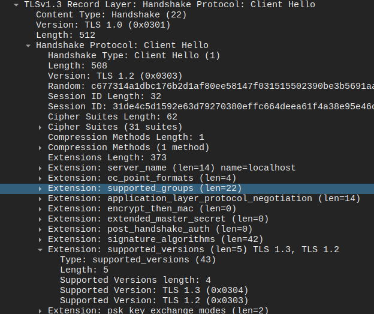
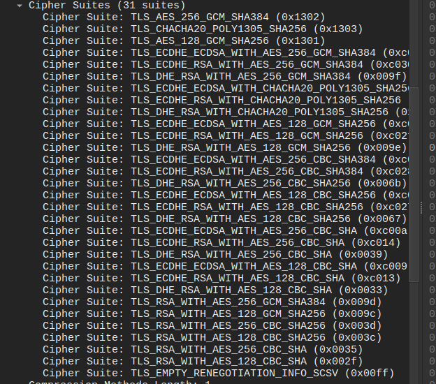
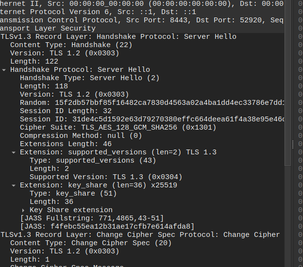

# Lab 4 — OS & Networking

## Task 1 — Trace a Request End-to-End

### 1.1 Start QuickNotes + Capture

QuickNotes was started locally on port `8080`:

```bash
cd app/
go run .
```

A packet capture was taken on the loopback interface:

```bash
sudo tcpdump -i lo -nn -s 0 -w lab4-trace.pcap 'tcp port 8080'
```

One request was sent to QuickNotes:

```bash
curl -v -X POST http://localhost:8080/notes \
  -H 'Content-Type: application/json' \
  -d '{"title":"trace me","body":"in flight"}'
```

The request succeeded:

```text
> POST /notes HTTP/1.1
> Host: localhost:8080
> User-Agent: curl/8.5.0
> Accept: */*
> Content-Type: application/json
> Content-Length: 39

< HTTP/1.1 201 Created
< Content-Type: application/json
< Date: Wed, 16 Sep 2026 09:38:55 GMT
< Content-Length: 93

{"id":7,"title":"trace me","body":"in flight","created_at":"2026-09-16T09:38:55.720570372Z"}
```

The packet capture was saved as `lab4-trace.pcap` and decoded with:

```bash
sudo tcpdump -r lab4-trace.pcap -nn -A | tee lab4-trace.txt
```

The decoded trace is included separately as `submissions/lab4-trace.txt`.

---

### 1.2 Decode the Capture

The request used the IPv6 loopback address `::1`. The client used ephemeral port `48798`, while QuickNotes listened on port `8080`.

#### TCP three-way handshake

The client initiated the connection with SYN:

```text
12:41:06.550570 IP6 ::1.48798 > ::1.8080:
Flags [S], seq 3777348432
```

The server responded with SYN/ACK:

```text
12:41:06.550640 IP6 ::1.8080 > ::1.48798:
Flags [S.], seq 1030331838, ack 3777348433
```

The client completed the handshake with ACK:

```text
12:41:06.550676 IP6 ::1.48798 > ::1.8080:
Flags [.], ack 1
```

Therefore, the TCP three-way handshake was:

```text
SYN -> SYN/ACK -> ACK
```

#### HTTP request

After the TCP connection was established, the client sent:

```text
12:41:06.550855 IP6 ::1.48798 > ::1.8080:
Flags [P.], seq 1:175, ack 1, length 174

POST /notes HTTP/1.1
Host: localhost:8080
User-Agent: curl/8.5.0
Accept: */*
Content-Type: application/json
Content-Length: 39

{"title":"trace me","body":"in flight"}
```

#### HTTP response

QuickNotes replied:

```text
12:41:06.551838 IP6 ::1.8080 > ::1.48798:
Flags [P.], seq 1:207, ack 175, length 206

HTTP/1.1 201 Created
Content-Type: application/json
Date: Wed, 16 Sep 2026 09:41:06 GMT
Content-Length: 93

{"id":8,"title":"trace me","body":"in flight","created_at":"2026-09-16T09:41:06.551046957Z"}
```

This confirms that the note was created successfully.

#### Connection close

The client initiated connection termination:

```text
12:41:06.552243 IP6 ::1.48798 > ::1.8080:
Flags [F.]
```

The server responded with its own FIN:

```text
12:41:06.552383 IP6 ::1.8080 > ::1.48798:
Flags [F.]
```

The client sent the final ACK:

```text
12:41:06.552464 IP6 ::1.48798 > ::1.8080:
Flags [.], ack 208
```

The capture therefore shows the complete request lifecycle:

```text
TCP handshake
    ↓
HTTP POST /notes
    ↓
HTTP/1.1 201 Created
    ↓
TCP connection close
```

---

### 1.3 Five Debugging Commands

#### 1. What is listening?

Command:

```bash
ss -tlnp | grep :8080
```

Output:

```text
LISTEN 0      4096               *:8080             *:*    users:(("quicknotes",pid=289095,fd=3))
```

Decision:

QuickNotes is running and listening on TCP port `8080`. The process is `quicknotes`, PID `289095`.

#### 2. Routes from the host

Command:

```bash
ip route show
```

Output:

```text
default via 10.240.16.1 dev wlp2s0 proto dhcp src 10.240.22.192 metric 600
10.0.85.2 dev outline-tun0 scope link src 10.0.85.1 linkdown
10.240.16.0/21 dev wlp2s0 proto kernel scope link src 10.240.22.192 metric 600
172.17.0.0/16 dev docker0 proto kernel scope link src 172.17.0.1 linkdown
172.19.0.0/16 dev br-ff9f5bec59f1 proto kernel scope link src 172.19.0.1
```

Decision:

The default route goes through gateway `10.240.16.1` on interface `wlp2s0`. Docker networks and an `outline-tun0` interface are also present.

#### 3. Reachability

Command:

```bash
mtr -rwc 5 localhost
```

Output:

```text
Start: 2026-09-16T12:46:34+0300
HOST: kabanchik Loss%   Snt   Last   Avg  Best  Wrst StDev
  1.|-- localhost  0.0%     5    0.1   0.1   0.1   0.1   0.0
```

Decision:

`localhost` is reachable with `0.0%` packet loss and approximately `0.1 ms` latency, which is expected for loopback traffic.

#### 4. DNS

Command:

```bash
dig +short example.com @1.1.1.1
```

Output:

```text
8.6.112.0
8.47.69.0
```

Decision:

The DNS resolver at `1.1.1.1` successfully resolved `example.com`, so DNS resolution is working.

#### 5. Logs

Command:

```bash
journalctl --user -u quicknotes -n 20 || true
```

Output:

```text
-- No entries --
```

Decision:

There are no journal entries for a `quicknotes` user service. This is expected because QuickNotes was started directly using `go run .` rather than as a user `systemd` service.

---

### 1.4 What Would I Check First if QuickNotes Returned 502?

If QuickNotes returned `502 Bad Gateway`, I would first verify whether the QuickNotes upstream process is running and listening on the expected port with `ss -tlnp | grep :8080`. A 502 usually means that a proxy or gateway received the request but could not obtain a valid response from the upstream application. I would then call QuickNotes directly with `curl http://localhost:8080/health` to separate an application failure from a proxy failure. If the application were not reachable directly, I would inspect the process state and logs. If the application worked correctly when accessed directly, I would continue checking reverse-proxy configuration, port mappings, routing, firewall rules, and DNS.

---

## Task 2 — Outside-In Debugging on a Broken Deploy

### 2.1 Reproduce the Broken Deploy

A first QuickNotes instance was started on port `8080`:

```bash
ADDR=:8080 go run . &
PID1=$!
sleep 1
```

The listener was verified with:

```bash
ss -tlnp | grep :8080
```

Output:

```text
LISTEN 0      4096               *:8080             *:*    users:(("quicknotes",pid=302664,fd=3))
```

A second QuickNotes instance was then started on the same port:

```bash
ADDR=:8080 go run . 2>&1 | tee /tmp/qn-broken.log &
PID2=$!
sleep 2
```

The second instance failed:

```text
2026/09/16 12:56:51 quicknotes listening on :8080 (notes loaded: 8)
2026/09/16 12:56:51 listen: listen tcp :8080: bind: address already in use
exit status 1
```

The running `go run` process was:

```bash
ps -ef | grep "go run" | grep -v grep
```

Output:

```text
kriss     302624  287990  1 12:56 pts/0    00:00:00 go run .
```

The exact root cause was:

```text
listen tcp :8080: bind: address already in use
```

The first QuickNotes instance already owned TCP port `8080`, so the second instance could not bind to the same address and port.

---

### 2.2 Outside-In Debugging Chain

#### Step 1 — Is the application process running?

Command:

```bash
ps -ef | grep quicknotes
```

Output:

```text
kriss     302664  302624  0 12:56 pts/0    00:00:00 /home/kriss/.cache/go-build/5a/5a9abb608c03bb111e2ae9a30b24ff64950bd0f0d6907a3cc6bb36f96f8f2e68-d/quicknotes
kriss     305387  287990  0 13:00 pts/0    00:00:00 grep --color=auto quicknotes
```

Decision:

A QuickNotes process is running. Therefore, the failure is not caused by the complete absence of an application process.

#### Step 2 — Is it listening?

Command:

```bash
ss -tlnp | grep 8080
```

Output:

```text
LISTEN 0      4096               *:8080             *:*    users:(("quicknotes",pid=302664,fd=3))
```

Decision:

Port `8080` is already occupied by an existing QuickNotes process. This strongly supports the port-conflict hypothesis.

#### Step 3 — Is it reachable from the host?

Command:

```bash
curl -s -o /dev/null -w "%{http_code}\n" http://localhost:8080/health
```

Output:

```text
200
```

Decision:

The existing QuickNotes instance is reachable locally and returns HTTP `200`. The network path to the currently running instance is working.

#### Step 4 — Is the firewall blocking traffic?

Command:

```bash
sudo iptables -L -n -v 2>/dev/null || sudo nft list ruleset 2>/dev/null || true
```

Relevant output:

```text
Chain INPUT (policy ACCEPT 0 packets, 0 bytes)

Chain OUTPUT (policy ACCEPT 461K packets, 270M bytes)
```

The host also contains Docker- and VPN-related chains, but there was no rule preventing the successful local request to `localhost:8080`.

Decision:

The firewall is not the cause of this failure. The local health check already succeeds, and the default INPUT policy is `ACCEPT`.

#### Step 5 — Does DNS work for localhost?

Command:

```bash
dig +short localhost
```

Output:

```text
127.0.0.1
```

Decision:

`localhost` resolves correctly to `127.0.0.1`. DNS is not the cause of the broken second deployment.

### Outside-In Conclusion

The outside-in chain showed that the existing QuickNotes instance was running, port `8080` was already listening, the service was reachable with HTTP `200`, the firewall was not blocking the request, and `localhost` resolved correctly. Therefore, the failure was local to process startup: the second QuickNotes instance attempted to bind to a port that was already in use.

---

### 2.3 Repair + Re-Verify

The original `go run` wrapper process had PID `302624`:

```bash
echo $PID1
```

Output:

```text
302624
```

The first repair attempt killed the `go run` wrapper:

```bash
kill $PID1
sleep 1
ADDR=:8080 go run . &
sleep 1
curl -s http://localhost:8080/health
```

However, the newly started instance still failed with:

```text
listen: listen tcp :8080: bind: address already in use
```

The health endpoint still returned:

```json
{"notes":8,"status":"ok"}
```

This showed that the compiled child `quicknotes` process was still alive and still owned port `8080`.

The listener was checked again:

```bash
ss -tlnp | grep 8080
```

Output:

```text
LISTEN 0      4096               *:8080             *:*    users:(("quicknotes",pid=302664,fd=3))
```

The remaining QuickNotes child process was then stopped:

```bash
kill 302664
sleep 1
```

QuickNotes shut down cleanly:

```text
2026/09/16 13:16:31 shutting down
```

The port was verified to be free:

```bash
ss -tlnp | grep 8080 || echo "port 8080 is free"
```

Output:

```text
port 8080 is free
```

A fresh QuickNotes instance was started:

```bash
ADDR=:8080 go run . &
sleep 1
```

Output:

```text
2026/09/16 13:16:47 quicknotes listening on :8080 (notes loaded: 8)
```

The new listener was verified:

```bash
ss -tlnp | grep 8080
```

Output:

```text
LISTEN 0      4096               *:8080             *:*    users:(("quicknotes",pid=316670,fd=3))
```

Finally, the health endpoint was checked:

```bash
curl -s http://localhost:8080/health
```

Output:

```json
{"notes":8,"status":"ok"}
```

The repair was successful: port `8080` was freed, a fresh QuickNotes instance bound successfully, and the health endpoint returned a healthy response.

---

### 2.4 Root Cause and Mini-Postmortem

**Root cause:** the second QuickNotes instance failed because TCP port `8080` was already owned by the first instance:

```text
bind: address already in use
```

**Blameless mini-postmortem:**

This failure is systemic because service startup depends on an external host resource: a TCP port that must be available at deployment time. If process lifecycle and port ownership are not managed explicitly, an old process, duplicate deployment, or incomplete restart can leave the expected port occupied and cause the next instance to fail. The first repair attempt also showed that killing a `go run` wrapper does not necessarily terminate the compiled child process, which makes process supervision important. This class of failure can be reduced by using a service manager such as `systemd`, container orchestration, explicit pre-start port checks, health checks, and deployment tooling that stops the previous instance before starting a replacement. Monitoring and structured startup logs should also surface bind failures immediately.


---

## Bonus Task — Decode the TLS Handshake

### B.1 Add an HTTPS Layer

Caddy was installed and configured as a TLS-terminating reverse proxy in front of QuickNotes.

The Caddy configuration was:

```caddyfile
localhost:8443 {
  reverse_proxy localhost:8080
}
```

Caddy was restarted:

```bash
sudo systemctl restart caddy
```

The service was verified as running:

```text
● caddy.service - Caddy
     Loaded: loaded (/usr/lib/systemd/system/caddy.service; enabled; preset: enabled)
     Active: active (running)
```

Port `8443` was listening:

```text
LISTEN 0      4096               *:8443             *:*
```

HTTPS connectivity was verified with:

```bash
curl -vk https://localhost:8443/health
```

Relevant output:

```text
* TLSv1.3 (OUT), TLS handshake, Client hello (1):
* TLSv1.3 (IN), TLS handshake, Server hello (2):
* SSL connection using TLSv1.3 / TLS_AES_128_GCM_SHA256 / X25519 / id-ecPublicKey
* using HTTP/2

< HTTP/2 200
< server: Caddy

{"notes":8,"status":"ok"}
```

This confirmed that Caddy successfully terminated TLS on `8443` and proxied the request to QuickNotes on `8080`.

---

### B.2 Capture the TLS Handshake

TLS traffic on port `8443` was captured with `tcpdump` and saved as:

```text
lab4-tls.pcap
```

The resulting capture size was:

```text
4.6K
```

A packet listing showed the TCP connection and encrypted TLS exchange between client port `52920` and server port `8443`.

---

### B.3 Decode with Wireshark

The capture was opened in Wireshark and filtered with:

```text
tls.handshake
```

Wireshark identified:

```text
Client Hello (SNI=localhost)
Server Hello
```

#### ClientHello

The ClientHello showed:

```text
Extension: server_name ... name=localhost
Extension: supported_versions ... TLS 1.3, TLS 1.2
Supported Version: TLS 1.3 (0x0304)
Supported Version: TLS 1.2 (0x0303)
```

The offered cipher suites included:

```text
TLS_AES_256_GCM_SHA384
TLS_CHACHA20_POLY1305_SHA256
TLS_AES_128_GCM_SHA256
```

along with additional TLS 1.2-compatible suites.

The `Version: TLS 1.2 (0x0303)` field inside the TLS 1.3 ClientHello is a legacy compatibility field. The actual protocol versions offered by the client are shown in the `supported_versions` extension.

Suggested evidence:

```text
submissions/images/clienthello.png
submissions/images/clienthello-ciphers.png
```

#### ServerHello

The ServerHello showed:

```text
Cipher Suite: TLS_AES_128_GCM_SHA256 (0x1301)
Extension: supported_versions (len=2) TLS 1.3
Supported Version: TLS 1.3 (0x0304)
```

Therefore, the negotiated parameters were:

```text
TLS version: TLS 1.3
Cipher suite: TLS_AES_128_GCM_SHA256
```

As in the ClientHello, the visible `Version: TLS 1.2 (0x0303)` field is the TLS 1.3 legacy compatibility value. The negotiated version is explicitly selected in the `supported_versions` extension.

Suggested evidence:

```text
submissions/images/serverhello.png
```

---

### Certificate Chain

The command from the lab was first attempted as:

```bash
openssl s_client -connect localhost:8443 -showcerts </dev/null
```

On this local Caddy setup, the handshake failed because the connection did not provide the `localhost` SNI name:

```text
tlsv1 alert internal error
no peer certificate available
Cipher is (NONE)
```

The command was repeated with explicit SNI:

```bash
openssl s_client -connect localhost:8443 \
  -servername localhost \
  -showcerts </dev/null
```

The certificate chain contained two certificates:

```text
0 s:
   i:CN = Caddy Local Authority - ECC Intermediate
   a:PKEY: id-ecPublicKey, 256 (bit); sigalg: ecdsa-with-SHA256

1 s:CN = Caddy Local Authority - ECC Intermediate
   i:CN = Caddy Local Authority - 2026 ECC Root
   a:PKEY: id-ecPublicKey, 256 (bit); sigalg: ecdsa-with-SHA256
```

The negotiated TLS session was:

```text
New, TLSv1.3, Cipher is TLS_AES_128_GCM_SHA256
Server public key is 256 bit
Server Temp Key: X25519, 253 bits
```

OpenSSL also reported:

```text
Verify return code: 20 (unable to get local issuer certificate)
```

This is expected for this local Caddy setup because the locally generated Caddy root CA is not part of OpenSSL's default public trust store.

The full output was saved as:

```text
lab4-cert-chain.txt
```

---

### Which Negotiation Step Excludes TLS 1.0 / 1.1?

TLS 1.0 and TLS 1.1 are excluded during protocol-version negotiation.

In the captured ClientHello, the `supported_versions` extension offers only:

```text
TLS 1.3
TLS 1.2
```

TLS 1.0 and TLS 1.1 are absent. The server then selects:

```text
Supported Version: TLS 1.3 (0x0304)
```

in the ServerHello.

Therefore, the negotiation step that eliminates TLS 1.0 and TLS 1.1 is the comparison of the client's offered versions with the server's supported versions, represented in modern TLS by the `supported_versions` extension. Since TLS 1.0 and TLS 1.1 are never offered or selected, the connection cannot negotiate either deprecated version.


### TLS Evidence Screenshots

#### ClientHello — supported versions and SNI



#### ClientHello — offered cipher suites



#### ServerHello — selected TLS version and cipher suite


